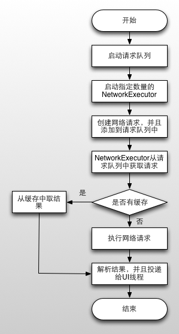
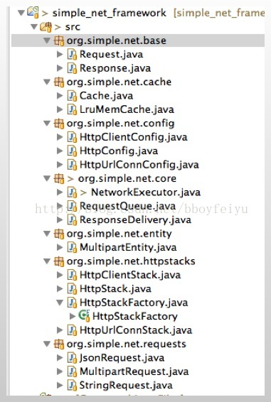
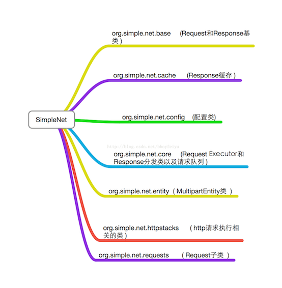
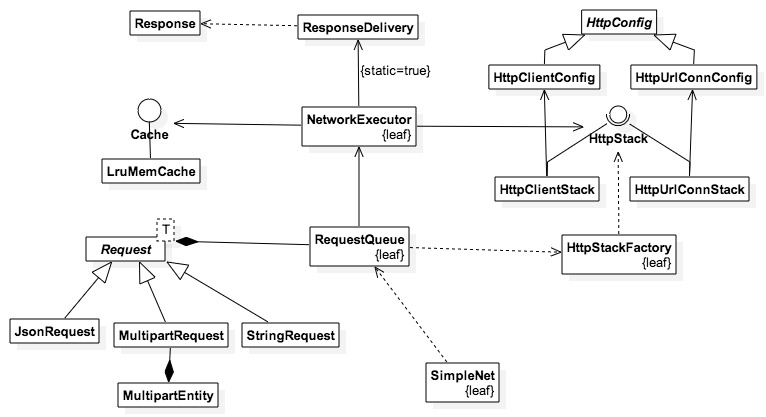

SimpleNet 的设计与实现 
====================================
> 本文为 [Android著名开源库的简版实现](https://github.com/simple-android-framework-exchange/simple-android-opensource-framework) 中的 SimpleNet 的设计与实现  
> 原始开源库： [Volley](https://github.com/mcxiaoke/android-volley)       
> 作者：[Mr.Simple](https://github.com/bboyfeiyu)，开发状态：完成/未完成，校对者：[Mr.Simple](https://github.com/bboyfeiyu)，校对状态：未开始    

## 1. 功能介绍  
SimpleNet是按照Volley的基本架构和核心原理来实现,其中省略掉了一些模块，比如CacheDispathcer等。SimpleNet能够执行网络请求,默认支持的请求类型有StringRequest、JsonRequest、MultipartRequest(可传递文件、图片参数)，也可以参考上述几个类自定义请求。SimpleNet执行网络请求，并且将结果投递给UI线程。其他的一些核心概念跟Volley都非常的类型，我们在这里只是以重复造轮子的态度去学习轮子构建过程，从而达到能够造轮子的地步。       
 
## 2. 总体设计
       

SimpleNet框架的基本结构类似于Volley,包括一些命名上也有跟Volley一致。它主要分为四个部分，最上面的部分为Request，即各种请求类型。例如返回的数据类型为json的对应为JsonRequest，返回数据字符串的为StringRequest，如果需要上传文件，那么你需要使用MultipartRequest，该请求只支持小文件的上传，如果上传的文件过大则会产生OOM。      

第二部分为消息队列，消息队列维护了提交给网络框架的请求列表，并且根据相应的规则进行排序。默认情况下更具优先级和进入队列的顺序来执行，该队列使用的是线程安全的PriorityBlockingQueue<E>，因为我们的队列会被并发的访问，因此需要保证访问的原子性。       
	
第三部分是Executor，也就是网络的执行者。该Executor继承自Thread，在run方法中循环访问第二部分的请求队列，请求完成之后将结果投递给UI线程。为了更好的控制请求队列，例如请求排序、取消等操作，这里我们并没有使用线程池来操作，而是自行管理队列和Thread的形式，这样整个结构也变得更为灵活。       

第四部分则是Response投递类，在第三部分的Executor中执行网络请求，Executor是Thread，但是我们并不能在主线程中更新UI，因此我们使用ResponseDelivery来封装Response的投递，保证Response执行在UI线程。         

每个部分职责都相对单一，这样便于日后的升级和维护。
 

## 3. 流程图

## 4. 详细设计
### 4.1 核心类详细介绍

* SimpleNet : 网络请求队列创建工厂类;
* NetworkExecutor : 执行网络请求的子线程类,不断地从请求队列中读取请求，并且执行网络请求或者从缓存中获取结果,并且将结果回调给UI线程; 
* RequestQueue : 网络请求队列;
* ResponseDelivery : 请求结果分发器,将结果投递给UI线程;
* HttpStack : 执行网络请求的接口;
* HttpClientStack : 使用HttpClient执行网络请求的HttpStack子类 ( api 9以下 );
* HttpUrlConnStack : 使用HttpURLConnection执行网络请求的HttpStack子类 ( api 9及其以上 );
* Request : 网络请求基类,是一个抽象的泛型类;
* Response : 请求结果类,封装了请求结果的各类信息以及结果实体的字节码数据;
* JsonRequest : 返回的数据类型是JsonObject的请求;
* StringRequest : 返回的数据类型是字符串的请求;
* MultipartRequest : 可传递文件、图片等参数的请求,返回的类型为String;
* HttpConfig : http请求配置的抽象类;

SimpleNet将各个子模块分布在不同的包中,并且尽量降低与其他类型的耦合，使得整个结构清晰、简单。    

SimpleNet，Request是一个抽象的泛型类，泛型类型就是返回的Response类型，例如StringRequest就是继承自Request<String>。第二部分的RequestQueue依赖于Request，Request是抽象的，因此任何Request的子类都可以传递到请求队列中来，它依赖的是抽象Request，而不是具体的某个实现，因此保证了可扩展性。你可以自己实现自己所需的Request，例如大文件的上传Request。同理，第三部分的NetworkExecutor也只是依赖于Request抽象，但这里又引入了一个类型HttpStack，这个网络请求的真正执行者，有HttpClientStack和HttpUrlConnStack，两者分别为Apache的HttpClient和java的HttpURLConnection，关于这两者的区别请参考:Android访问网络，使用HttpURLConnection还是HttpClient？。HttpStack也是一个抽象，具体使用HttpClient还是HttpURLConnection则由运行系统版本来定，HttpStackFactory会根据系统版本给框架返回对应的HttpStack。最后的ResponseDelivery比较简单了，只是通过Handler将结果投递给UI线程执行，也就是执行RequestListener的onComplete方法，此时网络执行完成，用户即可在该方法中更新UI或者相关的其他的操作。
	下面我们再看看SimpleNet的工程结构，如图所示。     
	
|        |      |
|--------|------|
|||									

这就是SimpleNet框架的基本结构了，如果期待下一篇博客的更新，就请顶个帖吧！谢谢~

### 4.2 类关系图
  
 

##5. 杂谈
该项目模仿Volley简单实现了一个网络请求框架，该库没有经过严格的测试，适合用于学习，不建议运用到项目中。当然你要是觉得没有什么问题，也可以在你的项目中使用。       
本篇文章，我们对SimpleNet做了一个简介，在后续的文章中我们再进行详细介绍，敬请期待。[SimpleNet的Request、Response类与请求队列](SimpleNet_Detail_1.md)、[SimleNet的Http请求分发与执行](SimpleNet_Detail_2.md)、[SimpleNet的请求配置与Response缓存](SimpleNet_Detail_3.md)。

